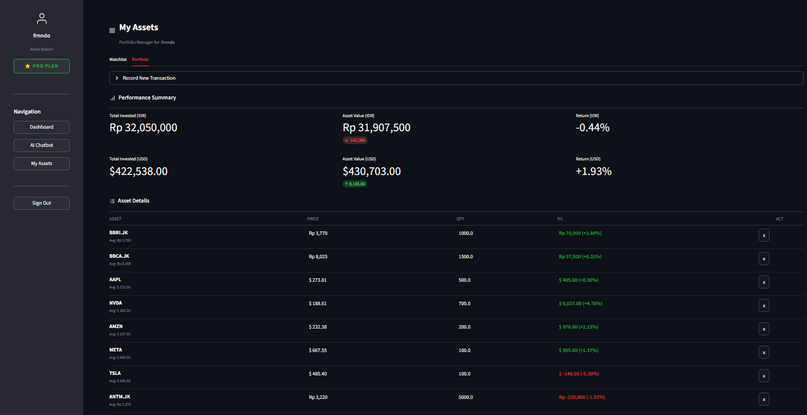
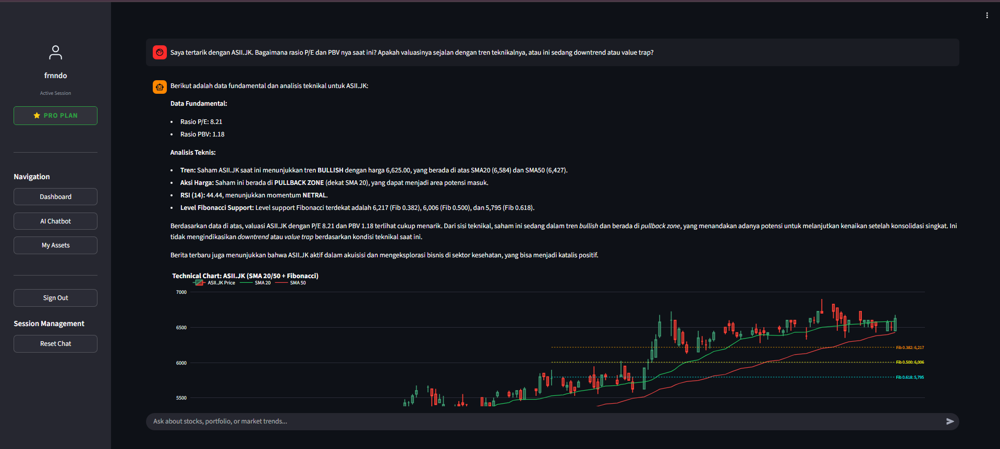

# FinAssist: AI-Powered Financial Dashboard & Chatbot

FinAssist is a streamlined financial analytics platform designed to provide real-time market insights and portfolio management. It integrates a live dashboard with an LLM-driven chatbot capable of performing technical and fundamental analysis on demand.


## Key Features

### 1. Market Dashboard
A centralized view for monitoring market movements.
- **Ticker Tape**: Real-time price tracking for major global and local (IDX) indices/stocks.
- **Global & Local News**: Aggregates financial news from international sources and specific Indonesian market updates via Google News.
- **Weekly Top Movers**: Automatically identifies and visualizes top-performing stocks across key sectors (Tech, Banking, Energy, Mining) using 7-day performance metrics.

### 2. Portfolio Management (Watchlist & Portfolio)
Tools for tracking personal assets.
- **Watchlist**: Track specific stocks with sparkline visualizations for quick trend assessment.
- **Portfolio Tracking**: Record buy transactions to monitor invested capital vs. current asset value.
- **Performance Metrics**: Automatically calculates unrealized gains/losses (P/L) and total portfolio return in both IDR and USD.



### 3. AI Financial Assistant
An interactive chatbot powered by Google Gemini 1.5 Flash, engineered for financial context.
- **Technical Analysis**: On-demand generation of interactive charts (Candlestick, SMA 20/50, Fibonacci Retracement).
- **Fundamental Data**: Fetches key metrics (P/E, PBV, Market Cap) directly from market data sources.
- **Context-Aware**: Can analyze the user's specific portfolio holdings to provide personalized recommendations (e.g., cut-loss or take-profit suggestions based on unrealized P/L).
- **Sentiment Analysis**: Summarizes market sentiment based on recent news for specific tickers.



## Tech Stack

- **Frontend**: Streamlit (Python)
- **AI/LLM**: Google Gemini 1.5 Flash (via Google Generative AI SDK)
- **Data Sources**:
  - `yfinance`: Historical and real-time stock data.
  - `GoogleNews` / `NewsAPI`: Market news aggregation.
- **Visualization**: Plotly (Interactive charts)
- **Architecture**: MVC (Model-View-Controller) pattern for maintainability.

## Installation

1.  **Clone the repository:**
    ```bash
    git clone https://github.com/fernandokurniawan23/Financial-Stock-Assistant-Chatbot.git
    cd FinAssist-Chatbot
    ```

2.  **Install dependencies:**
    ```bash
    pip install -r requirements.txt
    ```

3.  **Configure Environment Variables:**
    Create a `.env` file in the root directory and add your API keys.

4.  **Run the application:**
    ```bash
    streamlit run main.py
    ```

## Project Structure

```text
FinAssist/
├── modules/
│   ├── dashboard_model.py    # Data fetching & logic for Dashboard
│   ├── dashboard_view.py     # UI rendering for Dashboard
│   ├── chatbot_model.py      # LLM handling & tool injection
│   ├── finance_tools.py      # Technical analysis & plotting functions
│   ├── watchlist_model.py    # Portfolio data management
│   └── ui_assets.py          # Centralized CSS & SVG assets
├── images/                   # Screenshots for documentation
├── main.py                   # Application entry point
├── dashboard.py              # Dashboard controller
├── chatbot.py                # Chatbot controller
└── watchlist.py              # Portfolio controller